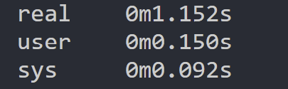

# indiv_proj2_yx248

Rust CICD Test Badge: [](https://github.com/nogibjj/indiv_proj2_yx248/actions/workflows/cicd.yml)

## Project Overview
### Rust CLI Binary with SQLite
This project is a simple Rust CLI application that demonstrates CRUD operations on an SQLite database. The CLI binary allows operations such as creating tables, inserting data from a CSV file, querying complex relationships, and individual CRUD operations.


## Table of Contents

- [Project Structure](#project-structure)
- [Requirements](#requirements)
- [Installation](#installation)
- [Usage](#usage)
- [Running Tests](#running-tests)
- [CRUD Functions](#crdu-functions)
- [Complex Query Explanation](#complex-query-explanation)
- [Sample Output](sample-output)
- [Acknowledgements](#acknowledgements)


## Project Structure

```bash
indiv_proj2_yx248 (Root Directory)
│
├── .devcontainer
│   ├── Dockerfile
│   └── devcontainer.json
│
├── .github
│   └── workflows
│       └── cicd.yml
│
├── indiv_proj2
│   ├── config.rs
│   ├── main.rs
│   ├── lib.rs
│   └── dataset_sample.csv
│
├── tests
│   └── test_main.rs
│   └── dataset_sample.csv
│
├── dataset_sample.csv
│
├── Cargo.toml
│
├── .env
│
├── env.example
│
├── requirements.txt
│
├── Makefile
│
├── README.md
│
└── .gitignore
```


## Requirements

The Rust project leverages several crates:

- Rust: Ensure you have Rust installed. If not, download and install from rust-lang.org.
- tokio: An asynchronous runtime.
- dotenv: To manage environment variables.
- futures: For future combinators.
- csv: To handle CSV data.
- mysql_async: For asynchronous database operations.
- Other dependencies are listed in the Cargo.toml file.


## Installation

1. Clone this repository.
2. Create a .env file using env.example as a template. Fill in your database credentials.
3. Build the project using Cargo:
    ```bash
    cargo build --release
    ```


## Usage

After building, you can run the program using:

    ```bash
    cargo run --release
    ```

    or

    ```bash
    cargo build
    cargo run
    ```


## Running Tests

To run the tests for the project, use:
    ```bash
    make test
    or
    cargo test
    ```


## CRUD Functions

- Create:
    ```bash
    // create tables if not exists (create)
    pub async fn create_tables_if_not_exists(pool: &Pool)

    // insert data from csv file (create)
    pub async fn insert_data_from_csv(pool: &Pool, filepath: &str)

    // function to insert data into the database (create)
    pub async fn insert_data(pool: &Pool, date: &str, product: &str, price: f64, quantity: i32)
    ```
- Read:
    ```bash
    // function to run a complex query (read)
    pub async fn complex_query(pool: &Pool)

    // function to check all the data in the database (read)
    pub async fn check_data(pool: &Pool)
    ```
- Update:
    ```bash
    // function to update data in the database (update)
    update_data(pool: &Pool, date: &str, product: &str, price: f64, quantity: i32)
    ```
- Delete:
    ```bash
    // clear the table (delete)
    pub async fn clear_table(pool: &Pool)

    // function to delete data from the database (delete)
    pub async fn delete_data(pool: &Pool, date: &str, product: &str)
    ```


## Complex Query Explanation

The complex SQL query used in this project performs the following operations:

1. Joins the main data table (`week6_mini`) with the discounts table (`week6_mini_discounts`) using the "Product" column.
2. Calculates the total revenue by multiplying price and quantity, considering any available discount.
3. Sorts the results by the calculated total revenue in descending order.

    ```sql
    SELECT w.Date, w.Product, w.Price, w.Quantity, d.Discount,
        (w.Price * w.Quantity) * (1 - d.Discount) AS Total_Revenue
    FROM week6_mini w
    LEFT JOIN week6_mini_discounts d ON w.Product = d.Product
    ORDER BY Total_Revenue DESC;
    ```


## Sample Output

- **Descriptive Statistics**:

    ```bash
    ("2023-09-03", "Apple", 1.1, 55, None, 60.500001311302185)
    ("2023-09-01", "Apple", 1.2, 50, None, 60.00000238418579)
    ("2023-09-02", "Apple", 1.3, 45, None, 58.49999785423279)
    ("2023-09-02", "Cherry", 2.4, 22, None, 52.800002098083496)
    ("2023-09-01", "Cherry", 2.5, 20, None, 50.0)
    ("2023-09-03", "Cherry", 2.6, 19, None, 49.3999981880188)
    ("2023-09-02", "Banana", 0.6, 50, None, 30.000001192092896)
    ("2023-09-03", "Banana", 0.7, 42, None, 29.399999499320984)
    ("2023-09-01", "Banana", 0.5, 40, None, 20.0)

    Checking data:
    ("2023-09-01", "Apple", 1.2, 50)
    ("2023-09-01", "Banana", 0.5, 40)
    ("2023-09-01", "Cherry", 2.5, 20)
    ("2023-09-02", "Apple", 1.3, 45)
    ("2023-09-02", "Banana", 0.6, 50)
    ("2023-09-02", "Cherry", 2.4, 22)
    ("2023-09-03", "Apple", 1.1, 55)
    ("2023-09-03", "Banana", 0.7, 42)
    ("2023-09-03", "Cherry", 2.6, 19)

    Inserting data:
    ("2020-01-01", "Apple", 1.0, 1)
    ("2023-09-01", "Apple", 1.2, 50)
    ("2023-09-01", "Banana", 0.5, 40)
    ("2023-09-01", "Cherry", 2.5, 20)
    ("2023-09-02", "Apple", 1.3, 45)
    ("2023-09-02", "Banana", 0.6, 50)
    ("2023-09-02", "Cherry", 2.4, 22)
    ("2023-09-03", "Apple", 1.1, 55)
    ("2023-09-03", "Banana", 0.7, 42)
    ("2023-09-03", "Cherry", 2.6, 19)

    Updating data:
    ("2020-01-01", "Apple", 1.0, 3)
    ("2023-09-01", "Apple", 1.2, 50)
    ("2023-09-01", "Banana", 0.5, 40)
    ("2023-09-01", "Cherry", 2.5, 20)
    ("2023-09-02", "Apple", 1.3, 45)
    ("2023-09-02", "Banana", 0.6, 50)
    ("2023-09-02", "Cherry", 2.4, 22)
    ("2023-09-03", "Apple", 1.1, 55)
    ("2023-09-03", "Banana", 0.7, 42)
    ("2023-09-03", "Cherry", 2.6, 19)

    Updating data:
    ("2020-01-01", "Apple", 2.0, 3)
    ("2023-09-01", "Apple", 1.2, 50)
    ("2023-09-01", "Banana", 0.5, 40)
    ("2023-09-01", "Cherry", 2.5, 20)
    ("2023-09-02", "Apple", 1.3, 45)
    ("2023-09-02", "Banana", 0.6, 50)
    ("2023-09-02", "Cherry", 2.4, 22)
    ("2023-09-03", "Apple", 1.1, 55)
    ("2023-09-03", "Banana", 0.7, 42)
    ("2023-09-03", "Cherry", 2.6, 19)

    Deleting data:
    ("2023-09-01", "Apple", 1.2, 50)
    ("2023-09-01", "Banana", 0.5, 40)
    ("2023-09-01", "Cherry", 2.5, 20)
    ("2023-09-02", "Apple", 1.3, 45)
    ("2023-09-02", "Banana", 0.6, 50)
    ("2023-09-02", "Cherry", 2.4, 22)
    ("2023-09-03", "Apple", 1.1, 55)
    ("2023-09-03", "Banana", 0.7, 42)
    ("2023-09-03", "Cherry", 2.6, 19)
    ```


## Acknowledgements

1. **Time Execution**: The `time` command in Linux can be used to measure the execution time.

    **Rust Binary Real Running Time**:
    ```bash
    time cargo run --release
    ```
    

    ### Rust Real Running Time Execution Time:
    Rust Real Running Time: Took approximately 1.152 seconds for execution.<br>


2. **Memory Usage**: The `heaptrack` tool can be utilized for Rust to measure memory usage.

    **Rust Memory Usage Test**:
    ```bash
    heaptrack cargo run --release
    heaptrack_gui heaptrack.week8mini.12345.gz
    heaptrack_print heaptrack.week8mini.12345.gz
    ```

    ### Memory Allocation Data:
    ```bash
    data:
        total runtime: 0.36s.
        bytes allocated in total (ignoring deallocations): 22.95MB (64.30MB/s)
        calls to allocation functions: 148589 (416215/s)
        temporary memory allocations: 55912 (156616/s)
        peak heap memory consumption: 8.65MB
        peak RSS (including heaptrack overhead): 84.04MB
        total memory leaked: 652.13KB
    ```
    For the Rust version, heaptrack profiling indicated a peak heap memory consumption of 8.65MB, with a total memory allocation of 22.95MB. The program made a notable 148,589 allocation function calls in just 0.36 seconds. The detected memory leak of 652.13KB is concerning and warrants further investigation and potential remediation, especially for extended or frequent program runs.<br>

    ### Memory Leak Detection:
    Using `valgrind`, potential memory issues were identified related to file operations on Unix-based systems. Specifically, there were unaddressable byte references in the statx system call. It is confirmed that they are derived from the Rust standard library itself and not from the project code.<br>


Video Demo：
    https://youtu.be/HLbi-tvwhO8
